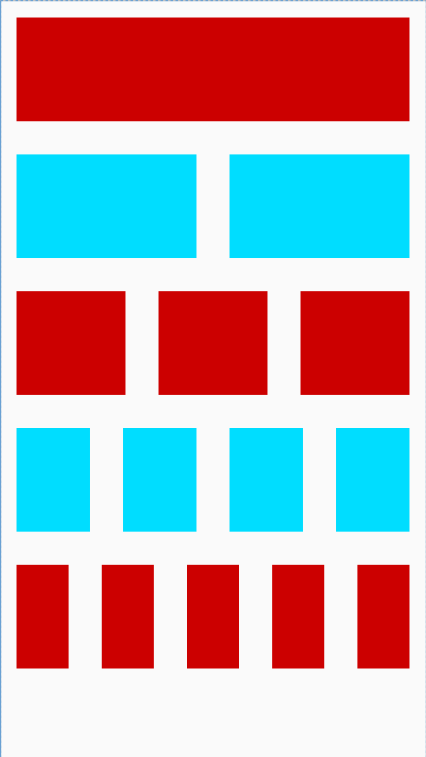

# PreviewRecyclerView
[](https://jitpack.io/#matsudamper/PreviewRecyclerView)


# Usage
<table>
<tr>
<td>Code</td>
<td>Preview</td>
</tr>
<tr>
<td>

```xml
<net.matsudamper.PreviewRecyclerView
    android:layout_width="match_parent"
    android:layout_height="match_parent"
    app:preview_1="@layout/view_red"
    app:preview_2="@layout/view_blue"
    app:preview_2_span="2"
    app:preview_3="@layout/view_red"
    app:preview_3_span="3"
    app:preview_4="@layout/view_blue"
    app:preview_4_span="4"
    app:preview_5="@layout/view_red"
    app:preview_5_span="5" />
```
</td>
<td>


</td>
</tr>
</table>
